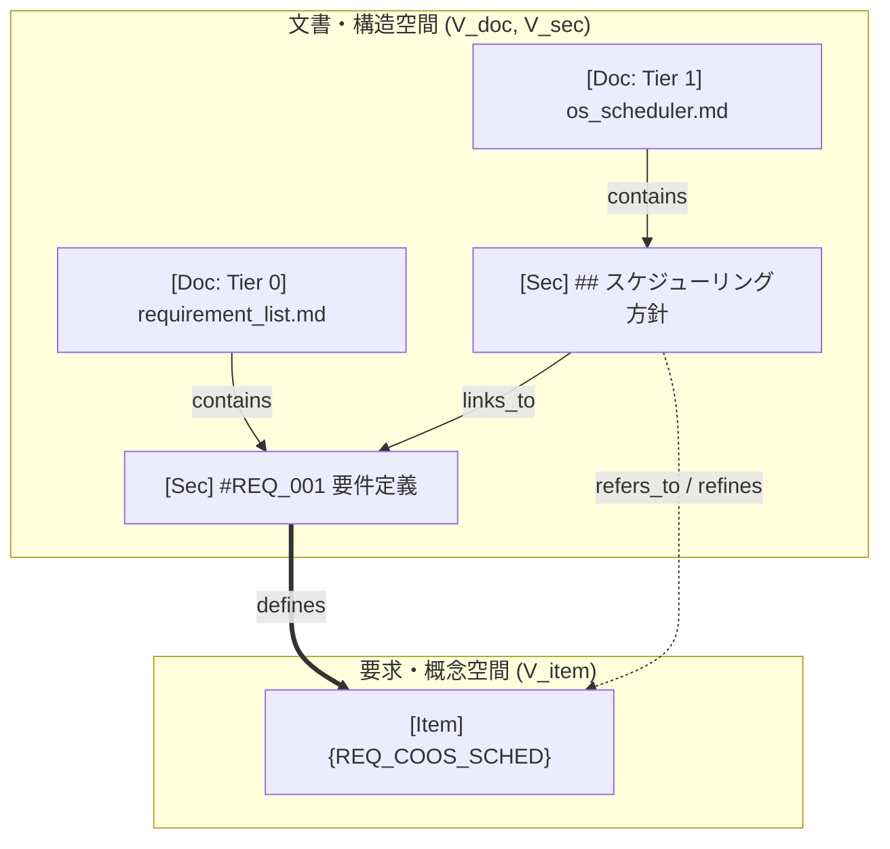

# spec-integrator 仕様書 (Specification Document)

`spec-integrator` は、仕様駆動開発（Specification-Driven Development）を採用するソフトウェア・システム開発プロジェクトにおいて、ドキュメントの構造、要求トレーサビリティ、Tier 階層依存、形式検証モデル（pyModelChecking）、およびセマンティック整合性（LLM as a Judge）を CI 上で厳格に検証・可視化するための汎用 Python CLI ツールです。

---

## 1. 背景と設計思想

大規模・高信頼システム（組み込み OS、ハイパーバイザ、分散システム等）では、ドキュメントが単なる説明資料ではなく**「コードと形式検証モデルに先行する設計正本（Single Source of Truth）」**となります。

`spec-integrator` は以下の原則に基づいて設計されています：
1. **設定駆動型（Configuration-Driven）**: プロジェクト独自のドキュメント階層（Tier 構造）やキーワードルールを設定ファイル（`spec-integrator.yaml`）で明示的に定義する。
2. **トポロジカル・ドキュメント空間（DocGraph）**: ファイルやセクション、要求キーワードを有向グラフ空間としてモデル化し、トレーサビリティの追跡や局所サブグラフの抽出を行う。
3. **形式検証と仕様書のコロケーション**: 重要なコンポーネント仕様書に対応する形式検証モデル（pyModelChecking）を同階層（`formal/`）に配置し、CI で自動モデル検査を実行する。
4. **CI ファースト**: 高速な静的検証＋形式検証を標準ゲートとし、単一の Markdown レポートと明確な終了コードを出力する。

---

## 2. DocGraph の空間モデル

DocGraph は、ドキュメント群の物理的構造と論理的な意味空間を有向グラフ $G = (V, E)$ としてモデル化します。



### (1) ノード空間 $V$
$$V = V_{\text{doc}} \cup V_{\text{sec}} \cup V_{\text{item}}$$

- **文書ノード $V_{\text{doc}}$**: Markdown ファイル単位。所属 Tier $\tau(d) \in \{0, 1, 2, 3, \text{Meta}\}$、ファイルパス、ハッシュを保持。
- **セクションノード $V_{\text{sec}}$**: 見出し単位（`##`, `###` 等）の論理ブロック。本文テキスト、開始/終了行番号、コンテンツハッシュを保持。
- **要求・概念ノード $V_{\text{item}}$**: 要件 ID、プロトコル識別子、メタ方針、グローバル制約（`{KEYWORD}`）。

### (2) エッジ空間 $E$
$$E = E_{\text{contain}} \cup E_{\text{define}} \cup E_{\text{refer}} \cup E_{\text{link}}$$

- **`contains`**: ドキュメント $\to$ 見出し、見出し $\to$ 子見出しの包含木関係。
- **`defines`**: セクションがその要求・概念の正本（Source of Truth）として定義を宣言している関係。
- **`refers_to`**: 設計セクションがその要求・概念を前提として実装・具体化・制約遵守している関係。
- **`links_to`**: Markdown 相対リンク `[text](path.md#anchor)` による直接参照。

### (3) 局所サブグラフ $G_r$ の抽出（LLM 評価空間）
特定の要件・キーワード $r \in V_{\text{item}}$ に対し、定義元セクション群 $\text{Def}(r) = \{ s \mid (s, r) \in E_{\text{define}} \}$ と参照設計セクション群 $\text{Ref}(r) = \{ s' \mid (s', r) \in E_{\text{refer}} \}$ を束ねた部分グラフ $G_r$ を抽出します。
これにより、LLM as a Judge に与えるべき**最小完全な評価コンテキスト**を自動生成します。

---

## 3. 設定ファイル仕様 (`spec-integrator.yaml`)

プロジェクトルートに配置する設定ファイルのスキーマ仕様です。

```yaml
version: "1.0"

project:
  name: "Fireball Hypervisor"
  docs_root: "docs"
  cache_db: ".spec-integrator/doc_cache.db"

# ドキュメント階層と Tier 定義
tiers:
  - tier: 0
    name: "Requirements"
    path_pattern: "docs/requires/**/*.md"
    description: "システム要求仕様書（正本）"

  - tier: 1
    name: "Core & Interface"
    path_pattern: "docs/components/tier1_*/**/*.md"
    description: "システムコア・共通インターフェース仕様書"

  - tier: 2
    name: "Runtime & Engine"
    path_pattern: "docs/components/tier2_*/**/*.md"
    description: "実行エンジン・JIT仕様書"

  - tier: 3
    name: "Platform & HAL"
    path_pattern: "docs/components/tier3_*/**/*.md"
    description: "ハードウェア・プラットフォーム抽象化仕様書"

  - tier: "meta"
    name: "Architecture & Plans"
    path_pattern: "docs/{architecture,plans}/**/*.md"
    description: "全体アーキテクチャ・開発計画"

# キーワードの定義元と分類
keywords:
  meta:
    pattern: "^META_[A-Za-z0-9_]+$"
    defined_in: "docs/architecture/document_structure.md"
  global:
    pattern: "^GLOBAL_[A-Za-z0-9_]+$"
    defined_in: "docs/architecture/document_structure.md"
  local:
    pattern: "^[A-Za-z0-9_]+$"
    defined_in: "docs/requires/**/*.md"

# 形式検証 (pyModelChecking) の設定
formal_verification:
  model_dir_name: "formal"           # 各コンポーネントディレクトリ配下のモデル配置先
  tag: "{VERIFY_FORMAL}"             # 形式検証を要求するメタデータタグ
  timeout_seconds: 30

# LLM as a Judge の設定
llm_judge:
  tag: "{VERIFY_LLM}"
  default_backend: "sakura"          # "sakura" または "ollama"
  backends:
    sakura:
      api_key_env: "SAKURA_API_KEY"
      model: "sakura-ai-model"
    ollama:
      endpoint: "http://localhost:11434"
      model: "llama3"
```

---

## 4. ドキュメント記述規約とタグ

### (1) キーワード記法
- 文書内の各セクション見出しまたは本文末尾に `{KEYWORD_NAME}` を記述します。
- **分類ルール**:
  - `META_*`: システム横断の非機能要件・設計方針。Tier 方向制約を受けず、どのドキュメントからも参照可能。
  - `GLOBAL_*`: 広域ポリシー。複数 Tier で共有可能。
  - ローカルキーワード: 個別要件・仕様 ID。定義元（Tier 0）に存在し、下位 Tier で参照されなければならない。

### (2) 検証レベル指定タグ
- **`{VERIFY_FORMAL}`**:
  - 設計仕様書内に付与することで、該当コンポーネントの `formal/` フォルダ内に pyModelChecking モデルスクリプトが存在し、モデル検査が PASS することを義務付けます。
- **`{VERIFY_LLM}`**:
  - 設計仕様書内に付与することで、`spec-integrator llm-judge` 実行時に対象サブグラフのセマンティック監査を実行します。

---

## 5. 品質ゲート（Quality Gates）と合否判定

`spec-integrator check` は以下の 4 つのゲートを順に検証し、**エラー 0 件**の場合のみ終了コード `0`（PASS）を返します。1 件でもエラーがあれば終了コード `1`（FAIL）となります。

| ゲート | 検証内容 | FAIL となる条件 |
| :--- | :--- | :--- |
| **Format Gate** | Markdown 相対リンクおよび見出しアンカーの存在検証 | リンク先ファイルが存在しない、または見出し `#anchor` が存在しない |
| **Traceability Gate** | キーワードの未定義参照および要件未参照の検証 | 定義元にない `{KEYWORD}` が参照されている、または Tier 0 要件が下位で 1 度も参照されていない |
| **Hierarchy Gate** | Tier 階層依存（上位から下位への詳細化原則）の検証 | 上位 Tier (N) が下位 Tier (N+1, N+2) の具象定義を直接参照（逆流依存）している |
| **Formal Gate** | `{VERIFY_FORMAL}` 対象の形式モデル検査 | モデルファイルが存在しない、構文エラー、または CTL 不変条件の検証失敗 |

---

## 6. 形式検証（pyModelChecking）連携仕様

各コンポーネント配下の `formal/` ディレクトリに、`pyModelChecking` を用いた検証スクリプトを配置します。

### スクリプト記述例 (`docs/components/tier1_core/formal/mutex_model.py`)
```python
from pyModelChecking import Kripke
from pyModelChecking.CTL import modelcheck, AG, Not, And, AtomicProposition


def build_model():
    S = ["s0", "s1", "s2"]
    S0 = {"s0"}
    R = [("s0", "s1"), ("s1", "s2"), ("s2", "s0")]
    L = {"s0": {"idle"}, "s1": {"busy"}, "s2": {"done"}}
    return Kripke(S=S, S0=S0, R=R, L=L)


def verify():
    km = build_model()
    # 相互排除等の不変条件を検証
    phi = AG(Not(And(AtomicProposition("idle"), AtomicProposition("busy"))))
    sat = modelcheck(km, phi)
    is_valid = km.S0.issubset(sat)
    return {
        "status": "PASS" if is_valid else "FAIL",
        "invariants": [{"formula": str(phi), "satisfied": is_valid}],
    }


if __name__ == "__main__":
    res = verify()
    print(res)
    exit(0 if res["status"] == "PASS" else 1)
```

`spec-integrator` はこの `verify()` 関数をロード・実行し、結果をパースして Formal Gate の判定とレポートに記録します。

---

## 7. SQLite データベーススキーマ

パースした構造情報および監査キャッシュは SQLite（`.spec-integrator/doc_cache.db`）に永続化されます。

```sql
CREATE TABLE documents (
    file_path TEXT PRIMARY KEY,
    tier INTEGER,
    component TEXT,
    content_hash TEXT,
    updated_at TEXT
);

CREATE TABLE sections (
    section_id TEXT PRIMARY KEY,      -- "rel_path#Heading"
    file_path TEXT,
    heading TEXT,
    level INTEGER,
    line_start INTEGER,
    line_end INTEGER,
    body_text TEXT,
    content_hash TEXT,
    FOREIGN KEY(file_path) REFERENCES documents(file_path)
);

CREATE TABLE keywords (
    keyword TEXT PRIMARY KEY,
    category TEXT,                    -- "local", "meta", "global"
    defined_in_file TEXT,
    defined_in_section TEXT,
    description TEXT
);

CREATE TABLE keyword_references (
    id INTEGER PRIMARY KEY AUTOINCREMENT,
    keyword TEXT,
    file_path TEXT,
    section_id TEXT,
    relation_type TEXT,               -- "defines" または "refers_to"
    line_number INTEGER,
    FOREIGN KEY(keyword) REFERENCES keywords(keyword),
    FOREIGN KEY(section_id) REFERENCES sections(section_id)
);

CREATE TABLE document_links (
    id INTEGER PRIMARY KEY AUTOINCREMENT,
    source_file TEXT,
    source_line INTEGER,
    target_path TEXT,
    target_anchor TEXT,
    is_valid INTEGER
);

CREATE TABLE formal_models (
    component TEXT PRIMARY KEY,
    model_path TEXT,
    framework TEXT,
    status TEXT,
    checked_at TEXT
);

CREATE TABLE audit_cache (
    hash_key TEXT PRIMARY KEY,
    rule_code TEXT,
    target_id TEXT,
    status TEXT,
    reason TEXT,
    updated_at TEXT
);
```

---

## 8. CLI コマンドリファレンス

### (1) `spec-integrator check`
ドキュメントの静的整合性・トレーサビリティ・Tier 依存関係および形式検証を一括実行します。

```bash
spec-integrator check [OPTIONS]
```
- **オプション**:
  - `-c, --config PATH`: 設定ファイルパス（デフォルト: `spec-integrator.yaml`）
  - `-r, --report PATH`: Markdown レポート出力先（デフォルト: `spec_report.md`）。リスク評価詳細・LLM 判定結果・3層一貫性監査結果もこの一枚に集約される。
  - `--clean`: キャッシュ DB を初期化してフルスキャン実行
  - `--verbose`: 詳細ログを出力

### (2) `spec-integrator llm-assess`
各要求／設計キーワードの複雑度・設計リスクを LLM でスコアリングし、検証義務台帳をキャッシュ DB に記録します（`--document` 指定時はドキュメント単位のアドバイザリー評価に切り替わる）。

```bash
spec-integrator llm-assess [OPTIONS]
```
- **オプション**:
  - `-c, --config PATH`: 設定ファイルパス
  - `--backend [openrouter|sakura|ollama|mock]`: LLM バックエンド指定（デフォルト: 設定ファイルの値）
  - `--model TEXT`: モデル名の明示的オーバーライド
  - `--document`: キーワード単位ではなくドキュメント単位で評価（アドバイザリーのみ。Obligation Gate には使われない）
  - `--max-keywords INT`: 評価する最大キーワード数（`--document` 時は無視）
  - `--max-documents INT`: `--document` 指定時の評価対象最大ドキュメント数
  - `-a, --all, --exhaustive`: 全 Tier（Requirements/Meta 含む）を網羅的に評価
  - `--min-references INT`: 評価対象に含める最小参照数（`--document` 時は無視）
  - `--include-meta` / `--include-reqs`: Architecture/Meta Tier・Tier 0 (Requirements) を候補に含める
  - `--tier TEXT`: 対象 Tier をカンマ区切りで指定（例: `0,1,2`）
  - `-o, --out PATH` / `-r, --report PATH`: `--document` 時のみ使用する JSON/Markdown 出力先（既定: `reports/doc_level_risk_report.json`/`.md`）。キーワード単位の結果はキャッシュ DB に記録され `check` レポートに反映されるため、これらは無視される。

### (3) `spec-integrator llm-judge`
3つの監査を常にまとめて実行し、判定結果をキャッシュ DB に記録します。専用フラグでどれか一つだけを選ぶことはできません:
1. `{VERIFY_LLM}` が指定されたサブグラフ（キーワードの定義セクション＋参照セクション）に対する意味監査。
2. ドキュメント単位の自己一貫性監査（サブグラフをまたぐ矛盾ではなく、1文書内部の矛盾・未裏付け主張を検証）。
3. Design → Test Spec → Test Code の 3 層トレーサビリティ監査。

```bash
spec-integrator llm-judge [OPTIONS]
```
- **オプション**:
  - `-c, --config PATH`: 設定ファイルパス
  - `--backend [openrouter|sakura|ollama|mock]`: LLM バックエンド指定（デフォルト: 設定ファイルの値）
  - `--model TEXT`: モデル名の明示的オーバーライド
  - `--component TEXT`: 3 層トレーサビリティ監査の対象を単一コンポーネントに限定
  - `--max-subgraphs INT`: サブグラフ意味監査で評価する最大サブグラフ数
  - `--max-documents INT`: ドキュメント単位監査で評価する最大文書数
  - `--max-targets INT`: 3 層トレーサビリティ監査で評価する最大コンポーネント数
  - `-a, --all, --exhaustive`: `{VERIFY_LLM}` タグの有無に関わらず全サブグラフ・全文書（Tier 0/Meta 含む全 Tier）を監査し、3 層トレーサビリティ監査も発見できる全コンポーネントを対象にする
  - `--min-references INT`: サブグラフ意味監査の対象に含める最小参照数。ドキュメント単位監査の候補選定には影響しない
  - `--include-meta` / `--include-reqs`: ドキュメント単位監査の候補選定に Architecture/Meta Tier・Tier 0 (Requirements) を含める
  - `--tier TEXT`: ドキュメント単位監査の候補選定を対象 Tier に限定（カンマ区切り、例: `0,1,2`）
  - `--changed-only`: `spec-consistency.lock` 以降に変更があったセクションに触れるサブグラフのみ意味監査（ドキュメント単位監査・3 層トレーサビリティ監査は常に全候補を対象にするため影響しない）
  - `--baseline LOCKFILE`: `--changed-only` の差分対象にする lockfile（既定: 作業ツリーの `spec-consistency.lock`）

判定結果はキャッシュ DB に記録され、`check` レポートの「LLM Judge Verdicts」節、「Whole-Document LLM Judge Verdicts」節、「Design -> Test Spec -> Test Code Chain Verdicts」節に反映される。

### (4) `spec-integrator graph`
DocGraph の抽出・可視化を行います。

```bash
spec-integrator graph [OPTIONS]
```
- **オプション**:
  - `-c, --config PATH`: 設定ファイルパス
  - `-f, --format [mermaid|json]`: 出力フォーマット（デフォルト: `mermaid`）
  - `-o, --out PATH`: 出力先ファイルパス（未指定時は標準出力）

### (5) `spec-integrator init`
カレントディレクトリに `spec-integrator.yaml` の雛形を生成します。

```bash
spec-integrator init
```

---

## 9. CI/CD (GitHub Actions) 連携例

`.github/workflows/document_audit.yml`:

```yaml
name: Document Specification Verification

on:
  push:
    branches: [ main, develop ]
  pull_request:
    branches: [ main, develop ]

jobs:
  verify-docs:
    runs-on: ubuntu-latest
    steps:
      - uses: actions/checkout@v4
        with:
          submodules: true

      - name: Set up Python
        uses: actions/setup-python@v5
        with:
          python-version: "3.12"

      - name: Install spec-integrator
        run: |
          pip install -e tools/spec-integrator

      - name: Run Spec Verification & Generate Report
        run: |
          spec-integrator check --config spec-integrator.yaml --report report.md

      - name: Add Report to GitHub Actions Step Summary
        if: always()
        run: |
          cat report.md >> $GITHUB_STEP_SUMMARY
```
